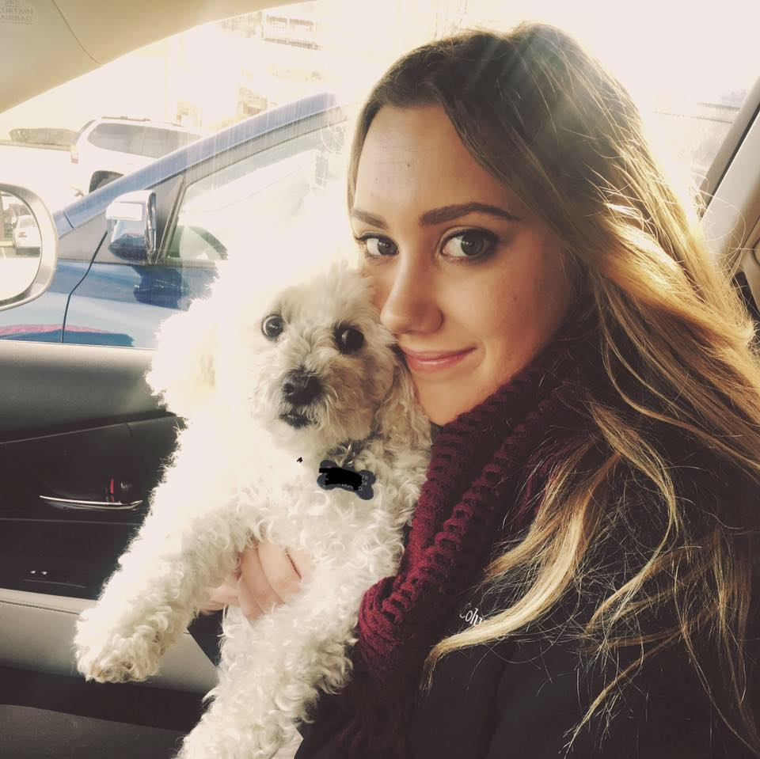

```{r setup, include=FALSE}
knitr::opts_chunk$set(echo = TRUE)
```

Hi, I'm Cathryn and welcome to my web page! 

I was born and raised in South Florida until the age of 14, when my mom and I moved to Beijing, China, for her job. I moved to Raleigh, North Carolina, at 15 and now attend Appalachian State University in Boone, NC. I have been back to China twice since moving to North Carolina, both times doing two month, summer internships in Beijing for International HR and International Marketing with the company CSOFT International. I have studied abroad in Innsbruck, Austria, during the summer of 2016 and plan on travelling more in the near future! I am a psychology major with a concentration in business and a minor in HR management; I plan to graduate this upcoming spring.  

My favourite things include dogs, travelling, Jeeps, and puns. I have three dogs: Indy, Bodie, and Tucker that I love very much. My favourite time of the year is autumn, when I can drive my Jeep down the Blue Ridge Parkway and see all the changing leaves and my favourite thing to eat is bread. 

```{r, echo=FALSE}

```


